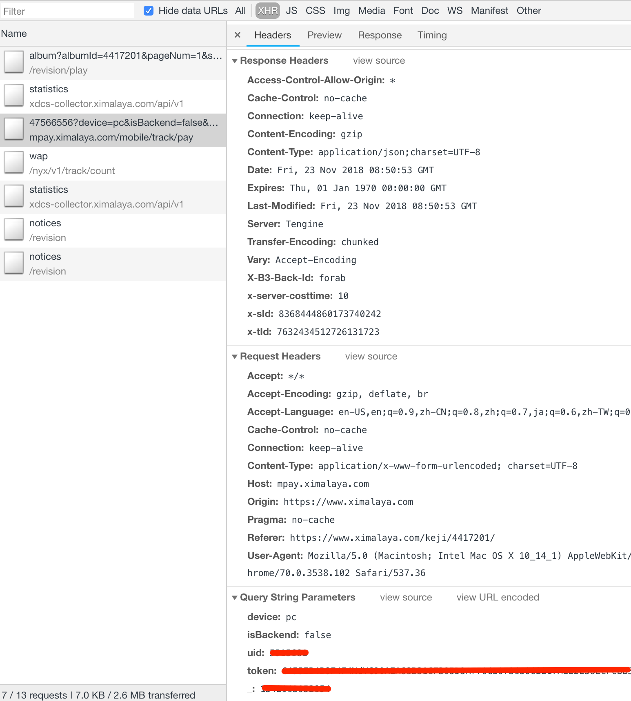

### 依赖环境

本工具依赖于 `Ruby` 执行环境。

`Linux` 或 `OS X` 环境，可以通过 `RVM` 或者 `rbenv` 来安装 `Ruby`，当然，如果只是临时使用，也可以用系统自带的。

#### RVM

`RVM` [官方地址](http://rvm.io/)。

```bash
# 安装
gpg --keyserver hkp://keys.gnupg.net --recv-keys 409B6B1796C275462A1703113804BB82D39DC0E3 7D2BAF1CF37B13E2069D6956105BD0E739499BDB
curl -sSL https://get.rvm.io | bash -s stable

rvm reload
rvm list known
rvm install 2.5.1
rvm use 2.5.1 —default

# 更新
rvm get stable
```

#### rbenv 

`rbenv` [官方地址](https://github.com/rbenv/rbenv)，下面以 `OS X` 平台来演示如何安装 `Ruby`。


```bash
# 安装
brew update
brew install rbenv ruby-build

rbenv init
rbenv versions
rbenv install 2.5.1

# 更新
brew upgrade rbenv ruby-build
```

了解更多 `Ruby` 相关知识，可以参考 [Ruby 编程手札](https://github.com/jameszhan/notes-ruby)。

#### 本工具依赖的 `gem`

```bash
gem install nokogiri
gem install faraday
gem install thor
```

### 下载喜马拉雅付费音频

> 本工具只能下载你本人已经付费过的喜马拉雅专辑，也就是指定的 `uid` 已经购买了该专辑。

#### 如何获取你的 `uid` 和 `token`

在电脑 `Chrome` 上随便打开一个喜马拉雅付费音频，并打开开发者工具(Developer Tools)，点击音频播放按钮，
在网络 `XHR` 中锁定检查支付的请求 `URL`，该 `URL` 以 `https://mpay.ximalaya.com/mobile/track/pay/` 开始。
此 `URL` 就包含你想要的 `uid` 和 `token`。

> 注意：VIP 和 自购是不同的 `token`



```bash
export XMLY_UID=YOUR_UID
export XMLY_TOKEN=YOUR_TOKEN
```

#### 激活工具

```bash
chmod +x xmly
./xmly

# Commands:
#   xmly album <album_id> <category> <dir>  # xmly album 4417201 keji /tmp
#   xmly download <audio_ids> <dir>         # xmly download 26903700,27251627 /tmp
#   xmly help [COMMAND]                     # Describe available commands or one specific command
```

### 示例演示

#### 下载专辑

下载[卓老板聊科技第二季](https://www.ximalaya.com/keji/4417201/)。

```bash
mkdir ~/keji4417201
./xmly album 4417201 keji ~/keji4417201
```

#### 批量下载多个音频

这个命令适合某些音频下载失败时候使用，音频 `ID` 可以从专辑下载的失败日志中拿到。

音频ID | 名称 | URL 
--- | --- | ---
45213979 | 发现天使粒子是怎么回事 | https://www.ximalaya.com/keji/4417201/45213979
37492676 | 认识人类的语言和手势 | https://www.ximalaya.com/keji/4417201/37492676
38739420 | 绘画和音乐是大脑发育的副产品 | https://www.ximalaya.com/keji/4417201/38739420

```bash
./xmly download 45213979,37492676,38739420 /tmp
```
